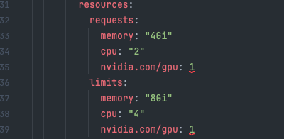
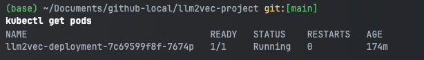

# Hugging Face LLM Models Deployment on Azure Kubernetes Service (AKS)

## Introduction
This repository contains the code to deploy Hugging Face LLM models on Azure Kubernetes Service (AKS).
the code in this repo uses [LLM2Vec](https://huggingface.co/McGill-NLP/LLM2Vec-Meta-Llama-3-8B-Instruct-mntp) as an example model from Hugging Face hub.

## Motivation
This project is aims to help data scientist deploy a model of their choice fast on an existing AKS cluster of Pwc | Next Azure Lab environment.

## Architecture
The architecture of the project is as follows:
1. The model is deployed as a REST API using FastAPI.
2. The REST API  Builds on a  Docker image locally.
3. the image is pushed to Azure Container Registry.
4.  node pools are Configure based on model requirements.
5. Create Kubernetes secrets for Hugging Face token
6. Apply secrets to cluster
7. Deploy application pods
8. Expose the application to the internet using a LoadBalancer service.
9. Check pod status and logs.
10. if ready - Verify service endpoints (external IP) and test the model.

## Prerequisites
- Azure Subscription
- Azure CLI
- kubectl
- Docker
- Hugging Face Token (some models require an additional form to fill out)

## Steps

1. Clone the repository
```bash
git clone git@github.com:roy2392/hf-models-via-aks.git
```
2. Login to Azure CLI
```bash
az login
```
3. Get credentials for AKS cluster
```bash
az aks get-credentials --resource-group llm2vec-rg --name llm2vec-cluster
```

4. Vertify the connection to the cluster
```bash
kubectl get nodes
```

5. you need to make sure the cluster resources are enough to deploy the model, you can check the available resources using the following command


6. create a new ACR (Azure Container Registry) using the following command
```bash
az acr create --resource-group llm2vec-rg --name your-registry-name --sku Basic
```
7. Build the docker image locally (make sure you have Docker installed)
```bash
az acr build --registry your-registry-name --image llm2vec:latest .
```
8. Deploy to AKS
```bash
kubectl apply -f deployment.yaml
```
9. Check pod status (copy the pode Name)

```bash
kubectl get pods
```
10. Check logs (paste the pod name)

```bash
kubectl logs <pod-name>
```
11. List all services
```bash
kubectl get services
```
12. Get service external IP (copy the EXTERNAL-IP):
```bash
kubectl get service llm2vec-service
```

13.question the model based on the EXTERNAL-IP showed up in the previous step
```bash
curl -X POST http://51.142.217.203/encode \
  -H "Content-Type: application/json" \
  -d '{
    "texts": ["This is a test sentence"],
    "instruction": "Represent the meaning of this text"
  }'
```