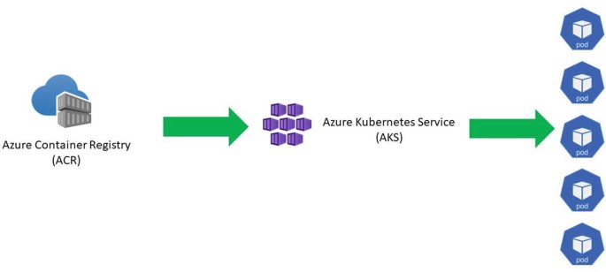
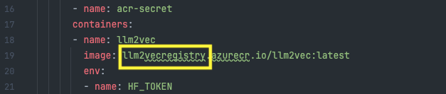
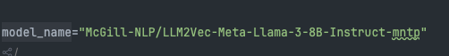

# Hugging Face LLM Models Deployment on Azure Kubernetes Service (AKS)

## Introduction
This repository contains the code to deploy Hugging Face LLM models on Azure Kubernetes Service (AKS).
the code in this repo uses [LLM2Vec](https://huggingface.co/McGill-NLP/LLM2Vec-Meta-Llama-3-8B-Instruct-mntp) as an example model from Hugging Face hub.

## Motivation
This project is aims to help data scientist deploy a model of their choice fast on an existing AKS cluster of Pwc | Next Azure Lab environment.



## Architecture
The architecture of the project is as follows:
1. The model is deployed as a REST API using FastAPI.
2. The REST API  Builds on a  Docker image locally.
3. the image is pushed to Azure Container Registry.
4.  node pools are Configure based on model requirements.
5. Create Kubernetes secrets for Hugging Face token
6. Apply secrets to cluster
7. Deploy application pods
8. Expose the application to the internet using a LoadBalancer service.
9. Check pod status and logs.
10. if ready - Verify service endpoints (external IP) and test the model.

## Prerequisites
- Azure Subscription
- Azure CLI
- kubectl
- Docker
- Hugging Face Token (some models require an additional form to fill out)

## Steps

1. Clone the repository
```bash
git clone git@github.com:roy2392/hf-models-via-aks.git
```
2. Login to Azure CLI
```bash
az login
```
3. Get credentials for AKS cluster
```bash
az aks get-credentials --resource-group llm2vec-rg --name llm2vec-cluster
```
* to create a new cluster, you can use the following command (only create new one if the existing one is not enough for the model requirements):
```bash
az aks create \
    --resource-group llm2vec-rg \
    --name llm2vec-cluster \
    --node-count 2 \
    --node-vm-size Standard_NC4as_T4_v3 \  # This is where the VM size is specified
    --enable-managed-identity \
    --generate-ssh-keys \
    --attach-acr llm2vecregistry
```
* to see the spec of a VM you can visit the [Azure VM sizes](https://docs.microsoft.com/en-us/azure/virtual-machines/sizes-gpu)

4. Vertify the connection to the cluster
```bash
kubectl get nodes
```

5. you need to make sure the cluster resources are enough to deploy the model, you can check the available resources (VM sizes available in the region) using the following command:
```bash
az vm list-sizes --location uksouth --output table | grep "NC"
```
* you can change the VM size in the node pool configuration in the deployment.yaml file


* create Create resource group (skip this step if you already have a resource group):
```bash
az group create --name llm2vec-rg --location uksouth
```
* Create ACR:
```bash
az acr create --resource-group llm2vec-rg --name your-registry-name --sku Basic
```
* Login to ACR:
```bash
az acr login --name your-registry-name
```
* Build the image:
```bash
  docker build -t your-registry-name.azurecr.io/llm2vec:latest .
```
* Push to ACR:
```bash
docker push your-registry-name.azurecr.io/llm2vec:latest
```

6. change the ACR name in the deployment.yaml file



7. Build the docker image locally (make sure you have Docker installed)
```bash
az acr build --registry your-registry-name --image llm2vec:latest .
```
8. Deploy to AKS
```bash
kubectl apply -f deployment.yaml
```
9. Check pod status (copy the pode Name)


```bash
kubectl get pods
```
10. make sure to create a secret for the Hugging Face token
```bash
kubectl create secret generic huggingface-token --from-literal=token=YOUR_HUGGING_FACE_TOKEN
```
11. Check logs (paste the pod name)

```bash
kubectl logs <pod-name>
```
12. List all services
```bash
kubectl get services
```
13. Get service external IP (copy the EXTERNAL-IP):
```bash
kubectl get service llm2vec-service
```

14. Question the model based on the EXTERNAL-IP showed up in the previous step
```bash
curl -X POST http://51.142.217.203/encode \
  -H "Content-Type: application/json" \
  -d '{
    "texts": ["This is a test sentence"],
    "instruction": "Represent the meaning of this text"
  }'
```
15. if you want to switch to a different model, you can change the model name via  the app.py file:




## License
This project is licensed under the MIT License - see the [LICENSE](LICENSE) file for details.